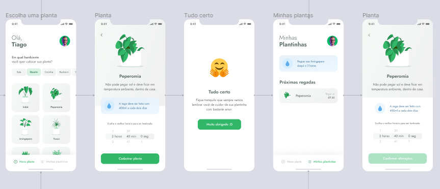

<h1 align="center">
   🌷 <a href="#"> Plant Manager </a> 🌼
</h1>

<h3 align="center">
    🌱 Your app to manage your plants. Never forget to water your plants! 🌱
</h3>

<p align="center">
  

  

  

   

  <a href="https://www.linkedin.com/in/ives-moreira-8871b318a/">
    
  </a>
</p>

## About

🌿 Plant Manager - is a way to you never forget to water your plants. We will remeber you whenever you need!
Project developed during **NLW - Next Level Week** offered by [Rocketseat](https://blog.rocketseat.com.br/primeira-next-level-week/). NLW is an online experience with lots of practical content, challenges and hacks where the content is available for a week.

---

## Features

- [x] You can register your plant:

  - [x] Choosing a plant type
  - [x] Filter a plant type per room
  - [x] Chossing a hour for watering your plant
  - [x] Receive curiosities and tips for watering your plants

- [x] Be remembered:
  - [x] See your registered plants
  - [x] Receive notification in your phone

---




---

## How it works

This project is divided into two parts:

1. Backend
2. Mobile

Mobile need the Backend to be running to work.

### Pre-requisites

Before you begin, you will need to have the following tools installed on your machine:
[Git](https://git-scm.com), [Node.js](https://nodejs.org/en/) and [Yarn](https://yarnpkg.com/).
Download the [Expo](https://expo.io/) application on your phone. In addition, it is good to have an editor to work with the code like [VSCode](https://code.visualstudio.com/).

#### Start Backend

Open this project in VSCode. Go to src/services.api.ts and change the IP address for your IP address.

```bash

# Clone this repository
$ git clone https://github.com/Ives-Gomes/PlantManager.git

# Access the project folder cmd/terminal
$ cd PlantManager

# install the dependencies
$ yarn

# Run the server in development mode
# (you need the json-server-cli in your computer)
# Put your IP after --host
$ json-server ./src/services/server.json --host 111.222.3.4 --port 3003 --delay 1000

# Go to the nexts steps

```

#### Start Frontend (mobile)

```bash

# Run the application in development mode
# (you need the expo-cli in your computer)
$ expo start

# Open your Expo application and scan the QRCode

```

---

## Tech Stack

The following tools were used in the construction of the project:

#### **Mobile** ([React Native](http://www.reactnative.com/) + [TypeScript](https://www.typescriptlang.org/))

- **[Expo](https://expo.io/)**
- **[Expo Google Fonts](https://github.com/expo/google-fonts)**
- **[Expo Vector Icons](https://docs.expo.io/guides/icons/)**
- **[Date Fns](https://date-fns.org/)**
- **[Expo Notifications](https://docs.expo.io/versions/latest/sdk/notifications/)**
- **[React Navigation](https://reactnavigation.org/)**
- **[Expo Constants](https://docs.expo.io/versions/latest/sdk/constants/)**
- **[React Native SVG](https://github.com/react-native-community/react-native-svg)**
- **[Axios](https://github.com/axios/axios)**
- **[Lottie React Native](https://github.com/react-native-community/lottie-react-native)**

> See the file [package.json](https://github.com/Ives-Gomes/PlantManager/blob/main/package.json)

#### **Utils**

- Editor: **[Visual Studio Code](https://code.visualstudio.com/)**
- Lint: **[Eslint](https://eslint.org/)**, **[Prettier](https://prettier.io/)**, **[EditorConfig](https://editorconfig.org/)**
- Fonts: **[Jost](https://fonts.google.com/specimen/Jost?query=jost)**
- Prototype: **[Figma](https://www.figma.com/file/wDfagtsHDzKskDHGGFIORM/PlantManager?node-id=0%3A1)**

---

## How to contribute

1. Fork the project.
2. Create a new branch with your changes: `git checkout -b my-feature`
3. Save your changes and create a commit message telling you what you did: `git commit -m "feature: My new feature"`
4. Submit your changes: `git push origin my-feature`

---

## Author

<a href="https://www.linkedin.com/in/ives-moreira-8871b318a/">
 
 <br />
 <sub><b>Ives Moreira</b></sub></a> <a href="https://www.linkedin.com/in/ives-moreira-8871b318a/" title="Linkedin"></a>
 <br />

---

## License

This project is under the license [MIT](./LICENSE).

Made with 💜 by Ives Moreira.
